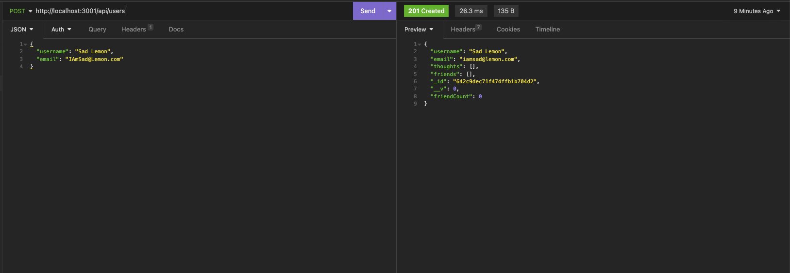

# Social Network API with MongoDB and Mongoose

## Description

This is the back end of a social network site that allows the creation of users, the creation of user thoughts, reactions to user thoughts, and 'connections' between users in the form of "friends." It shows the beginning server side functioning of what could evolve into a larger social networking site, complete with more complex interactions and with a front end as well, of course. It allowed me to practice developing back end systems that utilize MongoDB and Mongoose specifically, something I had not worked with before.

Video WalkThrough [here](https://drive.google.com/file/d/1_X6sa7jsPh-JwOdJXs9P3Eu8FqUXl5eI/view).

## Installation

To install, you'd have to download this repo, make sure to have node installed, as well as route testing software like Insomnia. In the video walkthrough linked above, you can see a demonstration of how to use this repo.

## Usage

This is not designed for users to use, but a walkthrough video showing its functionality is linked above.

